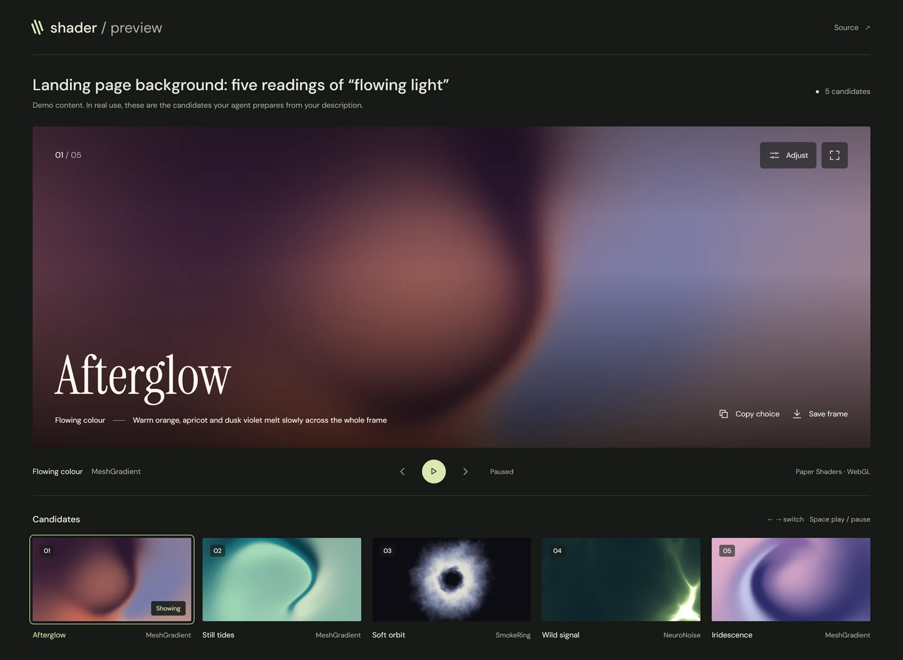

# shader-visual-kit

<p align="center"></p>

An agent skill for putting [Paper Shaders](https://shaders.paper.design) to work in real projects — web pages, React or vanilla apps, and Remotion videos. When there is a visual choice to make, the agent lays the candidates out on a preview page for you to compare and pick; a small Windows CLI starts the server behind it and reliably cleans up.

Your project keeps owning Paper, its parameters, presets and assets. The skill is development-time knowledge and copyable helper code, not a runtime layer; Paper Desktop is not required.

<sub>Unofficial; not affiliated with Paper. · [中文说明 →](README.zh-CN.md)</sub>

<p align="center"></p>

<p align="center"><sub>Native Paper components with curated parameters — MeshGradient, SmokeRing, NeuroNoise — used as demo candidates on the <a href="#preview-page">preview page</a>.</sub></p>

## What it does

- **From description to effect.** A visual word often has several readings that look nothing alike — "light and shadow" can be a beam from one point (GodRays) or slow, full-frame colour shapes (Warp, MeshGradient). The agent lists the readings, puts one candidate per reading on the preview page, and builds out only the one you pick, in your real entry point. Extending an effect to borders or buttons counts as a new choice and gets a candidate too.
- **Preview page.** A copyable React page ([`assets/preview/`](plugin/skills/shader-visual-kit/assets/preview/)) that the agent fills with the task's candidates, rendered by your project's own Paper: a large stage, live thumbnails, play / pause, an immersive view, PNG frames and one or two adjustments per candidate. Your pick and any adjustments come back through the URL hash or a *Copy choice* button.
- **Native integration.** `@paper-design/shaders-react` in React, `ShaderMount` from `@paper-design/shaders` in other browser hosts, mounted on the client and disposed on unmount. Effects and parameters come from Paper's own docs and your installed types, not from a whitelist kept by this tool.
- **Known pitfalls.** Full-page background stacking order, continuous `requestAnimationFrame` redraws at the display's refresh rate and how to budget them, default `fit`/`scale` shrinking effects on non-square elements, complementary hues averaging into mud, and embedded WebViews that never report being hidden.
- **Remotion.** Maps video frames to Paper's millisecond time and ships [`PaperFrame.tsx`](plugin/skills/shader-visual-kit/assets/PaperFrame.tsx), a helper you copy into your project. It holds each frame until textures are decoded, layout has settled and the GPU has finished, and fails the render rather than exporting a wrong frame.
- **Preview CLI (Windows).** Runs your project's own dev command inside a Windows Job Object and reports `address-responsive` only when the URL answers *and* the listener belongs to that job. It refuses occupied ports instead of adopting them, and the whole process tree goes away when you press Ctrl+C, when the CLI is killed, or when a launcher in its Windows parent chain exits.

## Install

### Claude Code

```text
/plugin marketplace add Zane-0x5a/shader-visual-kit
/plugin install shader-visual-kit@shader-visual-kit
```

### Codex

```text
codex plugin marketplace add Zane-0x5a/shader-visual-kit
codex plugin add shader-visual-kit@shader-visual-kit
```

### Other agents

```text
npx skills add Zane-0x5a/shader-visual-kit
```

Or copy [`plugin/skills/shader-visual-kit/`](plugin/skills/shader-visual-kit/) into your agent's skills directory.

Start a new session after installing. The installed plugin contains only the skill; the agent installs the matching CLI the first time a preview needs a new server.

## Usage

Ask in your own words, for example:

- “Add a slow, flowing Paper background behind the login page.”
- “The MeshGradient looks muddy on the light theme — fix it.”
- “Render this Paper scene as a 10-second Remotion video.”
- “Give me a few takes on a calm, light-filled hero background.”
- “Start the dev server and show me the effect.”

The skill's instructions are written in Chinese; agents follow them whatever language you use.

## Preview page

<p align="center"></p>

The agent copies [`assets/preview/`](plugin/skills/shader-visual-kit/assets/preview/) into a dev-only entry of your project — or, for non-React hosts and Remotion, a task-local preview project pinned to your Paper version — and describes each candidate as a small object; `render` returns your own Paper component:

```tsx
<ShaderPreview lang="en" title="Hero background: two readings of light" candidates={[
  { id: "rays", title: "Rays", effect: "GodRays", description: "A beam of warm light on a dark ground",
    controls: [{ id: "speed", label: "Speed", min: 0, max: 2, step: 0.05, value: 1, unit: "×" }],
    render: ({ playing, values }) => <GodRays {...rays} speed={playing ? 0.6 * values.speed : 0} /> },
  { id: "flow", title: "Flow", effect: "MeshGradient", description: "Slow multicolour shapes across the frame",
    render: ({ playing }) => <MeshGradient {...flow} speed={playing ? 0.3 : 0} /> },
]} />
```

The page needs only React and keeps its styles and yours apart in both directions; a candidate can render a section of your real layout (`layout: true` shows it untouched, with the caption below the stage), and fixed backgrounds stay inside the stage. To see it with the demo candidates:

```text
npm ci
npm run demo
```

Then open `http://127.0.0.1:5188/` (add `?lang=zh` for Chinese).

## Preview CLI

The agent installs the CLI version that matches the skill into a per-user tool directory, then runs it with node:

```text
npm install --prefix <tool-dir> github:Zane-0x5a/shader-visual-kit#v0.1.0
node <tool-dir>/node_modules/shader-visual-kit/cli/index.mjs preview --project <host-dir> --url http://127.0.0.1:5173/ --json -- npm run dev -- --port 5173 --strictPort
```

Tool events (`starting`, `address-responsive`, `warning`, `error`, `cleanup-error`, `stopped`) are JSON lines on stdout; host logs go to stderr. `address-responsive` proves HTTP 2xx from a listener this job owns — not that the page looks right.

Running the entry with node directly matters: some agent hosts stop a background task by ending the process they started (for example, Claude Code on Windows under Git Bash). Behind npx or an npm shell wrapper, that stop never reaches the CLI, because Git Bash's emulated fork breaks the Windows parent chain; with node, it does, and the job is cleaned up. Keep the CLI in a task its caller holds: a detached launch (`Start-Process`, `start`, `nohup &`) stops the preview when its launcher exits, and the CLI says so.

## Requirements

- **Skill:** any agent host that supports Agent Skills. Your project installs `@paper-design/shaders` / `@paper-design/shaders-react`, and Remotion if you make video. The preview page needs React, in your project or in a task-local preview project.
- **CLI:** Windows, Node.js 22.12+, PowerShell, and git for the GitHub install. On other systems the skill tells the agent to use the host's own process management.
- **Licenses:** Paper Shaders is Apache-2.0 and is not bundled here. Remotion has its own [license](https://remotion.dev/license); some companies need a company license. The preview page bundles Instrument Serif and DM Sans under the SIL Open Font License 1.1, with the license texts next to the fonts.

## What has been verified

Paper Shaders 0.0.81 (the latest release at the time of writing), Remotion 4.0.526, Chromium headless shell with ANGLE, Windows 11.

| Command | Covers |
| --- | --- |
| `npm test` | 12 CLI integration tests on real Windows processes — spaced and Chinese paths, argument fidelity including `& \| < > ^ % !`, occupied ports, redirects, timeouts, forced termination, an intermediate launcher being terminated, a launcher that exits while its server lives on, a foreign listener winning the startup race — plus release-consistency checks for versions, install payload and package contents |
| `npm run test:render` | `PaperFrame` through the real Remotion renderer: GPU upload failure cancels output, native mipmap sampling matches pixel for pixel, repeated / out-of-order / concurrent frames are identical, slow textures, 404 / CORS / invalid shader / zero size rejected, H.264 export |
| `npm run test:player` | Remotion Player: visible failure and recovery for oversized textures, null texture allocation, rapid slow-failing switches, unmount while loading, context loss, timeouts and missing WebGL |
| `npm run test:preview` | The preview page in a real browser: switching by thumbnail, arrow keys and hash links (with values clamped), adjustments kept per candidate and copied back in words, playback and pause on the Paper frame, PNG frames without `preserveDrawingBuffer` (layered candidates flattened at stage size), immersive view, lost WebGL context, reduced motion, phone layout, host styles kept apart in both directions, host layout shown without shade or caption over it, a fixed background held inside the stage, and a throwing candidate reported at once |
| `npm run test:hosts` | Two independent host projects in a temp directory (Paper 0.0.81 standalone, 0.0.80 in an npm workspace), each installed from its own lockfile, run through the CLI, checked for SSR, hydration and recovery, and exported to PNG and H.264; plus a task-local preview page pinned to Paper 0.0.80, started and stopped through the CLI, with its dev-only entry left out of the production build |

Installing from GitHub was also checked in isolated Claude Code and Codex configurations (only the skill lands in the plugin cache, and Codex lists it), along with `npx skills` discovery and the CLI install from its tag. The CLI was stopped as a real background task from both Git Bash and PowerShell without leaving processes behind, and an agent that had never seen the skill followed `preview.md` end to end: it installed the CLI, started a host's npm dev script, checked the page and stopped it cleanly.

Not promised: identical pixels across GPUs, every Paper effect, or frameworks beyond those tested (for example Next.js RSC). Check other versions in your own project.

## Repository layout

```text
plugin/                         What agent hosts install
  .claude-plugin/plugin.json      Claude Code manifest
  .codex-plugin/plugin.json       Codex manifest
  plugin.json                     Portable plugin manifest
  skills/shader-visual-kit/       SKILL.md, references/, assets/ (preview page, PaperFrame.tsx)
cli/                            Preview CLI, installed from git tags
demo/preview/                   Preview page with demo candidates (npm run demo)
docs/assets/                    README and social-preview media (npm run demo:capture)
tests/                          CLI, release, preview page, Remotion render / Player and host tests
.claude-plugin/marketplace.json Claude Code marketplace
.agents/plugins/marketplace.json Codex marketplace
```

## Development

```text
npm ci
npm test
npm run typecheck
npm run test:render
npm run test:player
npm run test:preview
npm run test:hosts
```

The render, Player and preview page tests use Remotion's browser or Playwright's; set `REMOTION_BROWSER_EXECUTABLE` to use a local Chromium. `test:hosts` needs network access to npm. `npm run demo:capture` re-renders the README media from the preview page's demo candidates at fixed Paper frames and needs ffmpeg on PATH.

To release, bump the version in `package.json`, the three plugin manifests and the Claude marketplace entry, and the pinned CLI tag in `references/preview.md` and both READMEs (`npm test` fails if they disagree), then push a `vX.Y.Z` tag.

## License

[MIT](LICENSE)
